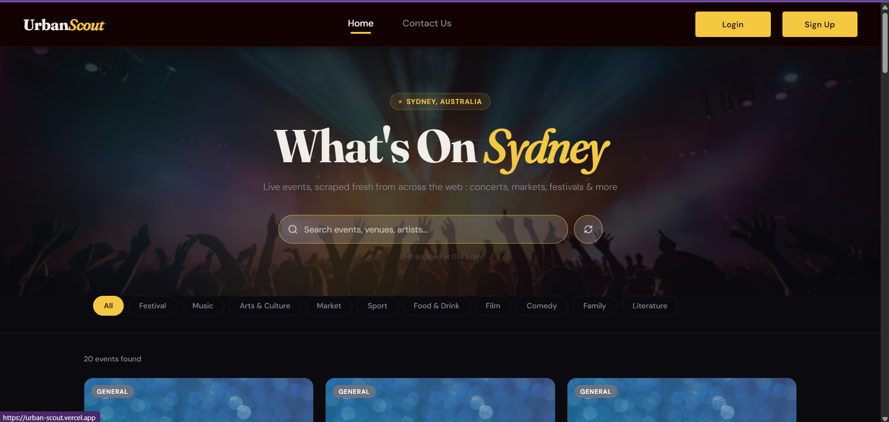
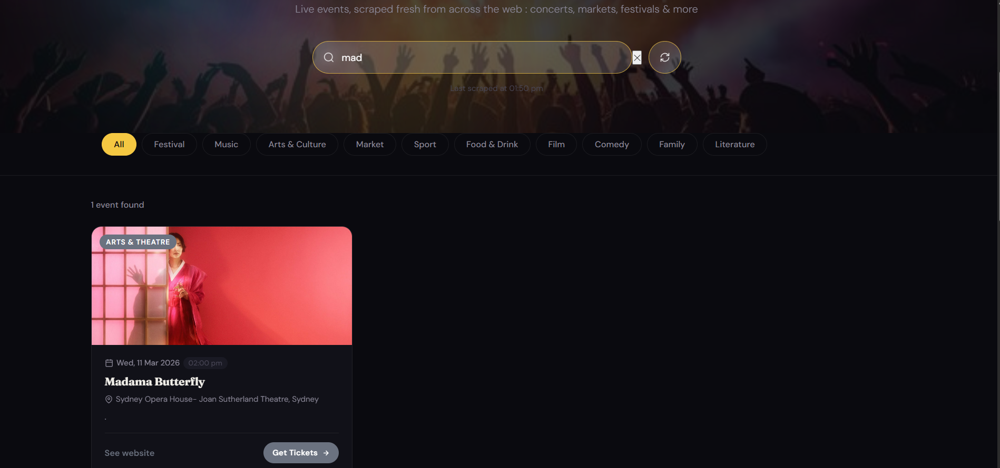
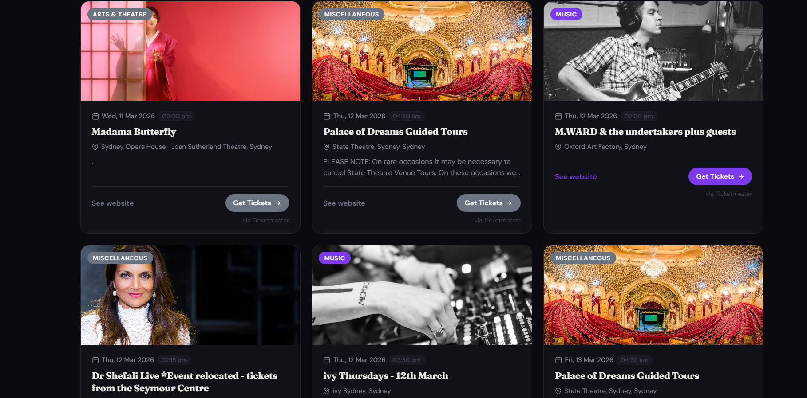
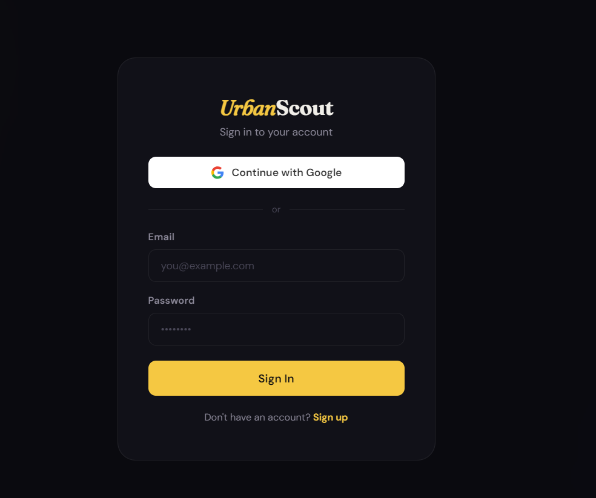
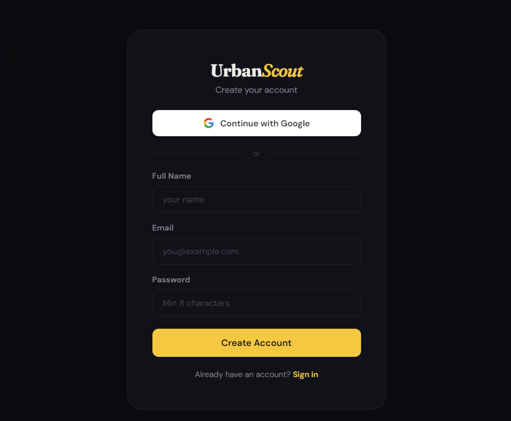
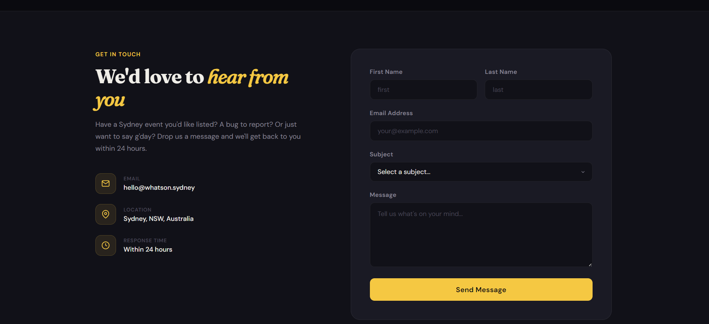

# UrbanScout: Live Events Finder

UrbanScout helps you discover what's happening in Sydney in real time. It automatically gathers events from multiple sources, so you don’t have to jump between different websites.

[](https://urban-scout.vercel.app/)


## Features

- Auto-scrapes events from Ticketek
- Category filtering: Music, Festival, Market, Sport & more
- Live search with debounce across title, description, and location
- Auto-refresh every 30 minutes with a manual refresh option
- Fully responsive on mobile and desktop
- Ticketmaster integration 
- Login/Signup via Google OAuth

  
## Tech Stack

- **Next.js 14** (App Router)
- **React 18**


## UI Preview

### Homepage
<p align="center">
  
</p>

---

### Event Search & Results
<p align="center">
  
</p>

---

### Events Listing
<p align="center">
  
</p>

---

### Authentication

<p align="center">
  
  
</p>

---

### Contact Page
<p align="center">
  
</p>

## Getting Started

```bash
# Install dependencies
npm install

# Start the dev server
npm run dev
```

Open http://localhost:3000 in your browser.


## API Integration

For more reliable and richer data, the app integrates the Ticketmaster API using environment variables.

## Authentication (Google OAuth)

Google OAuth (via NextAuth) is used for authentication, allowing users to quickly sign in and access personalized features.

For local development:

```
http://localhost:3000/api/auth/callback/google
```

For production (Vercel):

```
https://urban-scout.vercel.app/api/auth/callback/google
```

### Env Setup

Create `.env.local` and add:

```bash
GOOGLE_CLIENT_ID=...
GOOGLE_CLIENT_SECRET=...
NEXTAUTH_SECRET=...
NEXTAUTH_URL=http://localhost:3000
```

### Install Authentication Dependencies

```
npm install next-auth
```

## Project Structure

```
src/
├── app/
│   ├── api/
│   │   └── events/
│   │       └── route.js       # API endpoint with caching
│   ├── components/
│   │   └── EventCard.jsx      # Event card component
│   ├── globals.css            # All styling
│   ├── layout.jsx             # Root layout + fonts
│   └── page.jsx               # Main page
└── lib/
    └── scraper.js             # Multi-source scraper
```

## Deployment

Deploy easily to Vercel:

```bash
npm install -g vercel
vercel
```

The site automatically revalidates scraped data every 30 minutes via Next.js ISR.
